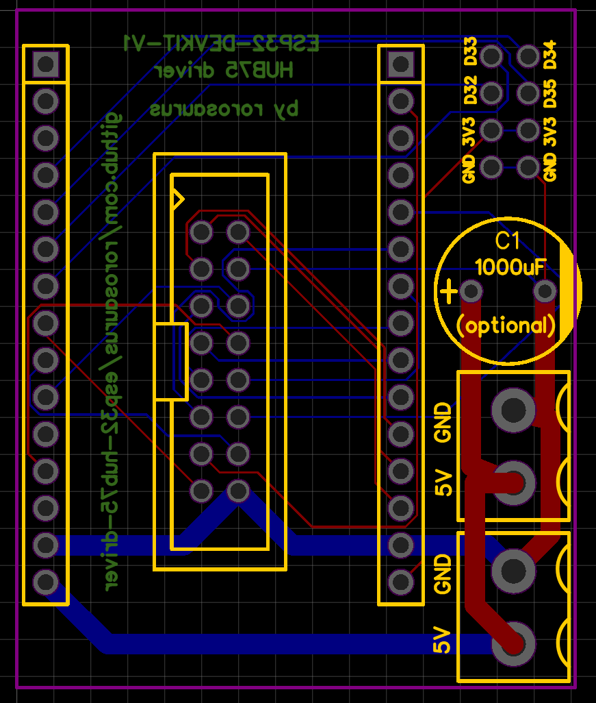

# Use a ESP32-DEVKIT-V1 to drive HUB75 LED panels using SmartMatrix library

Inspired by [Adafruit's RGB Matrix Featherwing Kit](https://www.adafruit.com/product/3036)! But cheaper and more powerful, with Wifi/BT!

## Features
* Connects all necessary pins to drive HUB75 panels using `ESP32_FORUM_PINOUT` from [MatrixHardware_ESP32_V0.h](https://github.com/pixelmatix/SmartMatrix/blob/teensylc/src/MatrixHardware_ESP32_V0.h)
* 2x screw terminals to allow you to share 5V from the microUSB to your panels.
  * Traces are wide enough to support 5V@3A total
* Optional room for 1x Electrolytic Capacitor (I use a 16V 1000uF) to smooth the 5V power
* 2x4 pins for additional GPIO use: 
  * 2x GND
  * 2x 3.3V
  * 4x GPIO with ADC functionality (for buttons, potentiometers, etc.)
* Only one 16 pin IDC output, but this should support multiple HUB75 panels daisy-chained in series

## Hardware
* Required:
  * ESP32-DEVKIT-V1: [Amazon ($7)](https://smile.amazon.com/gp/product/B07Q576VWZ/), [AliExpress ($4)](https://www.aliexpress.com/item/32902307791.html)
  * Female Pin Header 2X8 (connects this driver to the HUB75 panel): [Amazon](https://smile.amazon.com/gp/product/B07VJ3JCLT/), [AliExpress](https://www.aliexpress.com/item/32747224548.html)
  * Any HUB75 type scan LED panel (E pin is connected, so should work with 1/32 panels too)
* Optional:
  * If you want easy disconnect for ESP32:
    * 15 Pin Single Row Female Pin Header (if you want the ESP32 to be removeable): [AliExpress](https://www.aliexpress.com/item/32962790286.html)
  * If you want easy disconnect for panel power:
    * Power cables for HUB75 panels (might have come with your panel): [AliExpress](https://www.aliexpress.com/item/32832930794.html)
    * Screw terminals (up to 2 can be used to easily wire power to the panels): [AliExpress](https://www.aliexpress.com/item/32993227789.html)
  * If you want easy jumper wire access to the 8 extra GPIO and power pins:
    * Female Pin Header 2X4: [AliExpress](https://www.aliexpress.com/item/32785938092.html)
  * If you want to smooth the power spikes (might prolong device lifespan or prevent brownouts):
    * Electrolytic Capacitor 16V 1000uF: [AliExpress](https://www.aliexpress.com/item/32812085542.html)

## Software
I would recommend using the following software with this board:
* https://www.arduino.cc/en/Main/Software - The Arduino IDE, to program everything!
  * https://github.com/espressif/arduino-esp32 - Install board manager support for ESP32
  * https://github.com/me-no-dev/arduino-esp32fs-plugin - This Arduino IDE plugin makes it simple to upload .gifs to your ESP32
* https://github.com/marcmerlin/AnimatedGIFs - This code is a good starting point for your program. It uses the above software and libraries to playback animated .gifs for you! You can easily adjust things like the time between switching .gifs. You'll need to install (by downloading and copying to `My Documents/Arduino/libraries`) a few libraries that it uses:
  * https://github.com/pixelmatix/SmartMatrix/tree/teensylc
  * https://github.com/adafruit/Adafruit-GFX-Library
  * https://github.com/marcmerlin/Framebuffer_GFX
  * https://github.com/FastLED/FastLED
  * https://github.com/marcmerlin/SmartMatrix_GFX

* Use your preferred image editor to make your animated .gifs! I used Photoshop, but you could also use GIMP or something!

## Design
Gerber file download: [/gerber/esp32-hub75-driver.zip](https://github.com/rorosaurus/esp32-hub75-driver/blob/master/gerber/esp32-hub75-driver.zip)

